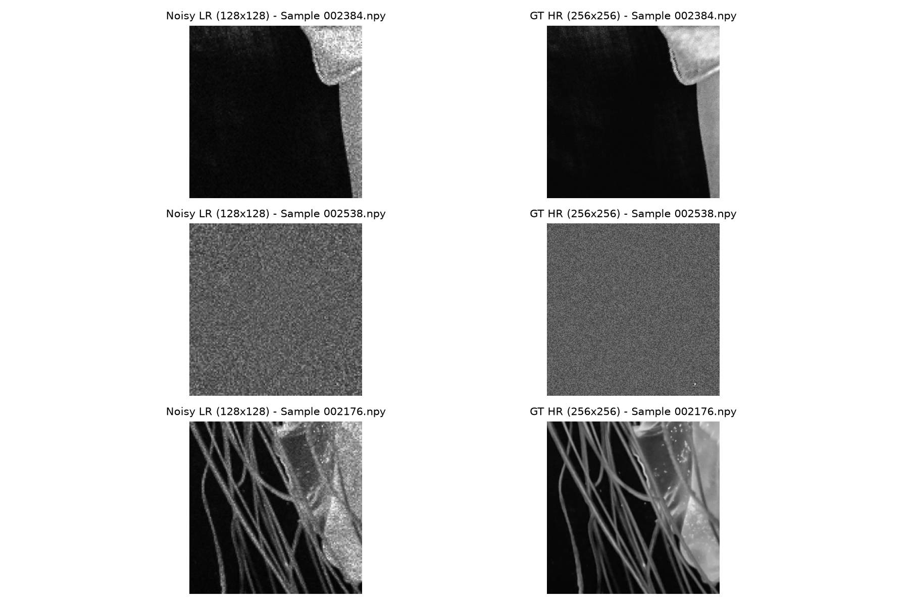
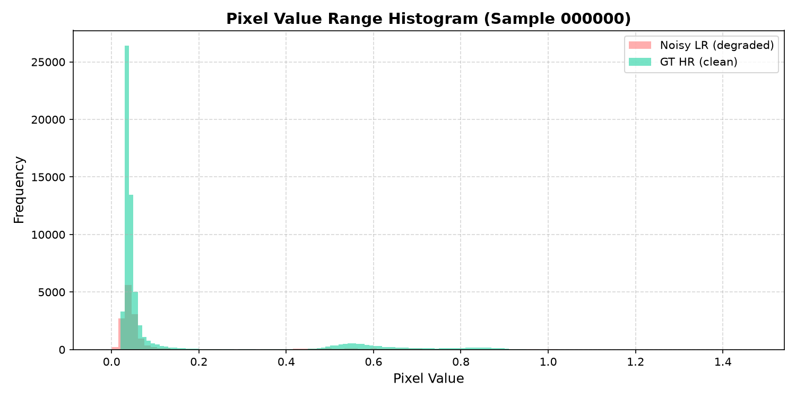
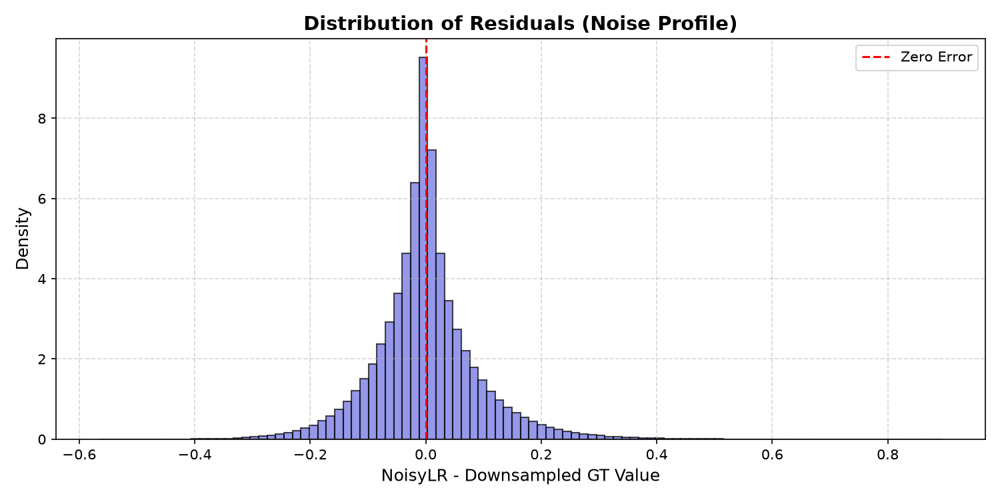
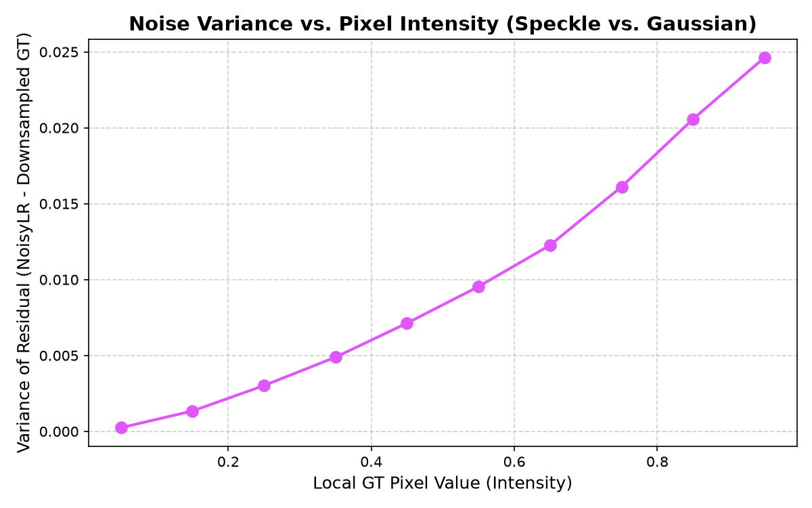

# EDA Report - Dataset Reconnaissance

## 1. Resolution Verification
- **All pair resolutions checked**: Verified that every training pair is exactly 2x resolution increase (`128x128` to `256x256`).
- **Test set resolution**: Verified that all test set files are `128x128`.
- **Dimensions**:
  - Degraded Inputs (NoisyLR): `(128, 128)`
  - Ground Truth Inputs (GT): `(256, 256)`

## 2. Pixel Value Range & Noise Overshoot
- **Ground Truth Range**: `[0.0000, 1.0000]` (perfectly normalized in `[0, 1]`).
- **Noisy Low-Res Range**: `[-0.1065, 1.8370]`
- **Noise Overshoot**: Noisy inputs overshoot significantly below 0 (down to `-0.1065`) and above 1 (up to `1.8370`).
- **Key Takeaway**: The network must handle inputs in this wider range, but should output values clipped to the target range `[0, 1]`.

## 3. Noise Profile Analysis
- **Residual Distribution (NoisyLR - Downsampled GT)**: Mean is `0.000016` and Std Dev is `0.089237`.
- **Estimated Noise Type**: `Multiplicative Speckle (Variance scales with intensity)`.
- **Variance vs Intensity Correlation**: `0.9804`.
  - *Speckle test*: If variance changes with intensity, it points to multiplicative/signal-dependent noise. In our case, the correlation coefficient between the local GT intensity and the noise variance is `0.9804`.
  
## 4. Visualizations
Visualizations have been generated and saved under `docs/images/`:
- **Side-by-side Comparison**: 
- **Pixel Value Range Histogram**: 
- **Noise Profile Histogram**: 
- **Noise Variance vs Intensity Plot**: 
